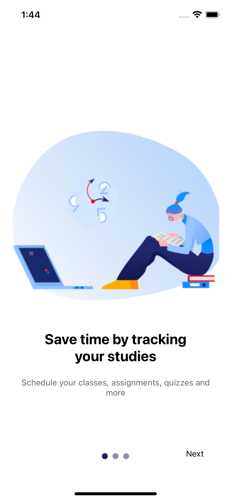
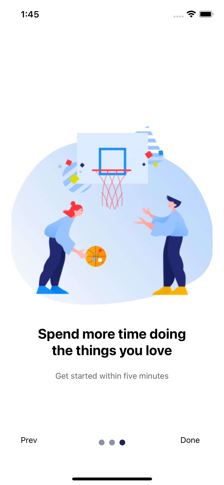

# rn-OnBoard

## Setup

```bash
git clone <repo>

# Install gems
bundle install

# Install dependencies
yarn install

# Install ios native dependencies (cocoapods)
yarn pod install

# Run react-native packager
yarn start

```

## Run

To build and install the app in the iOS Simulator run:

```bash
yarn ios
```

## Output images






### Happy coding
